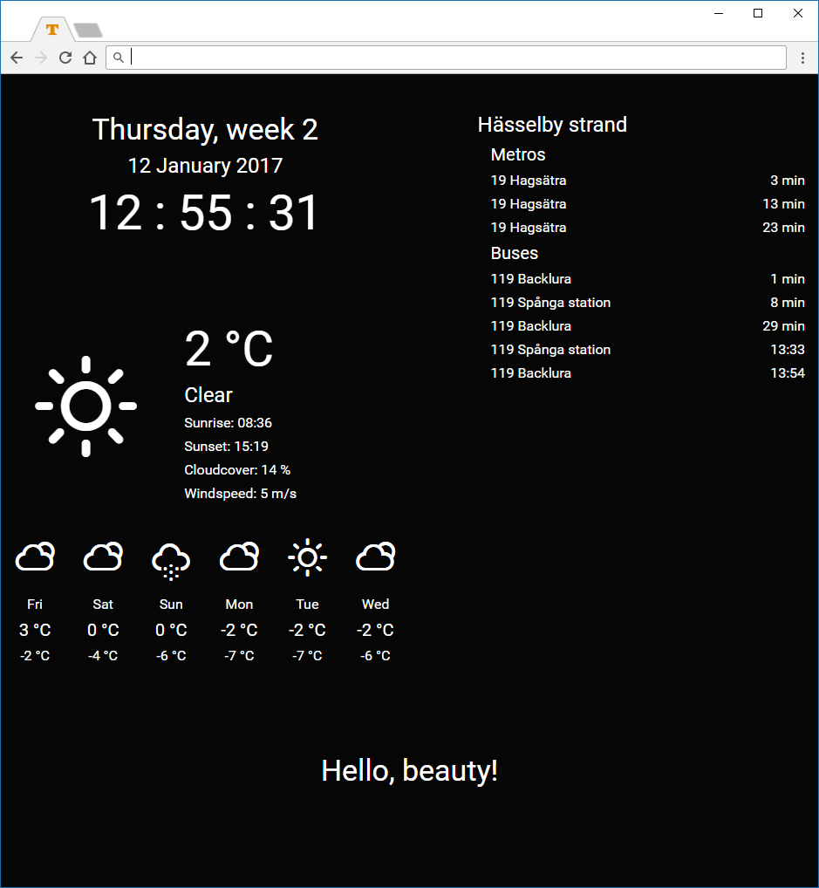
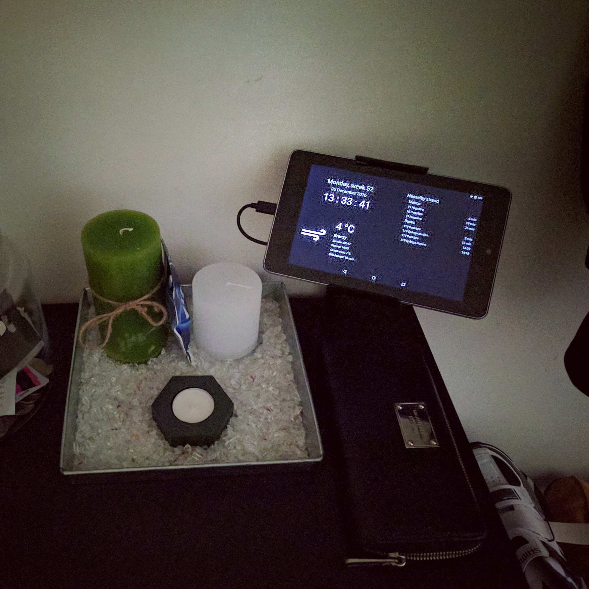

# LobbyMirror

Web project that shows both departures for [SL](https://sl.se) (Greater Stockholm Local Transit Company) and weather information (by [Dark Sky](https://darksky.net)).

### Table of Contents

- [How to use](#how-to-use)
  - [Installation](#installation)
  - [Configuration](#configuration)
  - [API tokens](#api-tokens)
- [Screenshots](#screenshots)
- [Credits](#credits)

## How to use

Clone to repository to a server of your choice running eg. Nginx and PHP.

If you don't have any at home, you can always go for an instance at [DigitalOcean](https://m.do.co/c/452a006a298d).

### Installation

The [composer.json](./composer.json) contains the required packages for the project to work, so use [composer](https://getcomposer.org) to get the required packages in place.

### Configuration

You need to place a config.php file in the root with a config that looks similar to the one in [config-example.php](./config-example.php).

Make a copy of config-example.php and call it config.php and update your settings to your likings.

```shell
cp config-example.php config.php
```

### API tokens

For the dashboard to fully work, you need to supply two API tokens.

#### SL Realtidsinformation 4 (by [trafiklab.se](https://www.trafiklab.se))

Link: [trafiklab.se/api/trafiklab-apis/sl/departures-4](https://developer.trafiklab.se/api/sl-realtidsinformation-4)

Since the API check quite frequently for updates, you need to upgrade to [Silver][https://developer.trafiklab.se/api/sl-realtidsinformation-4] level or limit the dashboard of running.

By default you only get 10 000 requests per month, which is not sufficiently.

#### Weatherforcast with Dark Sky API

Link: [darksky.net](https://darksky.net)

_Due to termination by Apply, Dark Sky is no longer accepting new signups._

## Screenshots

This is the view of LobbyMirror in a browser:



This is how it's looking on a tablet:




## Credits

- Authors: Tobias Lindberg – [List of contributors](https://github.com/tobiasehlert/teslamateapi/graphs/contributors)
- Distributed under MIT License
